# AutoGarage Formatief - Week 1

## 📋 Overzicht

Dit project betreft de uitwerking van een **formatieve toets**. De opdracht test de voorkennis van studenten die beginnen aan het leren OOP programmeren. Maak onderstaande opdracht en gebruik de uitwerking om je eigen werk te controleren.

## 🎯 Doel van de Opdracht

Opdracht: maak de applicatie zoals onder omschreven en volgens onderstaande modellen in C#.

Het doel van deze formatieve toets is om vast te stellen of de vereiste voorkennis aanwezig is voor het volgen van Web Application Development en om te identificeren welke onderdelen nog bijgeschaafd moeten worden. 

**Tijdsinschatting:** Deze opdracht zou in één dag geprogrammeerd moeten kunnen worden.

## 🎓 Leeronderwerpen

Deze formatieve opdracht test of je de volgende onderwerpen beheerst:

1. **Classes maken** - Definiëren van klassen zoals `Vehicle`, `CarOwner` en `CommercialVehicle`
2. **Objecten maken** - Instantiëren van objecten en gebruik van constructors
3. **Attributen en properties maken** - Declareren van velden en properties met getter/setter
4. **Access modifiers** - Correct gebruik van `public`, `protected` en `private`
5. **Methods maken** - Implementeren van methoden en business logic
6. **Encapsulation** - Data hiding en het gebruik van properties voor gecontroleerde toegang
7. **Inheritance** - Overerving van `Vehicle` naar `CommercialVehicle`
8. **Polymorphisme** - Gebruik van virtual/override methoden (zoals `CheckLicensePlate()`)
9. **Data access layer maken** - Implementatie van CRUD operaties in `DALSQL` klasse
10. **Database maken** - Ontwerpen en implementeren van SQL Server database schema

## 📝 Opdrachtbeschrijving

De eigenaar van een autogarage wil bijhouden welke voertuigen bij welke eigenaar horen. Er bestaan gewone auto's en bedrijfswagens. Voor bedrijfswagens wordt een maximaal trekgewicht geregistreerd.

### Functionele Requirements

| ID | Requirement | Prioriteit |
|----|-------------|------------|
| E1 | De garagehouder voegt een eigenaar toe | 100 |
| V1 | De garagehouder voegt een auto toe aan een eigenaar | 90 |
| V6 | De garagehouder voegt een bedrijfswagen toe aan een eigenaar | 80 |
| V5 | De garagehouder registreert het trekgewicht van een bedrijfswagen | 75 |
| A1 | De garagehouder bekijkt een lijst van eigenaren met bijbehorende voertuigen | 70 |
| V2 | De eigenaar wijzigt het kenteken van het voertuig | 60 |
| V3 | Het kenteken bestaat uit 8 karakters met exact twee koppeltekens | 60 |
| V4 | Het kenteken van een bedrijfswagen begint met een V | 60 |
| V5 | De garagehouder verwijdert een voertuig | 60 |

### Technische Randvoorwaarden

- **Programmeertaal:** .NET Core (versie 7.0)
- **Applicatietype:** Console applicatie
- **Database:** SQL Server
- **Architectuur:** Minimaal 3 applicatielagen:
  - UI (User Interface)
  - Business Logic
  - Data Access Layer

## 🏗️ Architectuur

### Class Diagram
Het project implementeert het volgende conceptuele klassendiagram:

**Klasse beschrijvingen:**
- **CarOwner**: Vertegenwoordigt een eigenaar van voertuigen
  - `Name`: string - Naam van de eigenaar
  
- **Vehicle**: Basisklasse voor voertuigen
  - `Description`: string? - Beschrijving van het voertuig
  - `LicensePlate`: string - Kenteken van het voertuig
  
- **CommercialVehicle**: Erft over van Vehicle
  - `TowingWeight`: int - Trekgewicht van het bedrijfsvoertuig

### Use Case Diagram
Het systeem ondersteunt de volgende use cases:

```mermaid
flowchart TB
    subgraph System ["🏢 Garagesysteem"]
        UC1(("UC1:<br/>Eigenaar toevoegen"))
        UC2(("UC2:<br/>Lijst met eigenaren en<br/>voertuigen bekijken"))
        UC3(("UC3:<br/>Kenteken wijzigen"))
        UC4(("UC4:<br/>Voertuig verwijderen"))
        UC5(("UC5:<br/>Voertuig toevoegen"))
    end
    
    Actor{{"�<br/>Garagehouder"}}
    
    %% Actor associations
    Actor --- UC1
    Actor --- UC2
    
    %% Extend relationships
    UC5 -.->|"≪extends≫"| UC2
    UC3 -.->|"≪extends≫"| UC2
    UC4 -.->|"≪extends≫"| UC2
    
    %% Styling
    classDef actor fill:#e1f5fe,stroke:#01579b,stroke-width:2px,color:#000000
    classDef usecase fill:#f3e5f5,stroke:#4a148c,stroke-width:2px,color:#000000
    classDef system fill:#e8f5e8,stroke:#1b5e20,stroke-width:2px,color:#000000
    
    class Actor actor
    class UC1,UC2,UC3,UC4,UC5 usecase
    class System system
```

**Use Cases:**
- **UC1: Eigenaar toevoegen** - De garagehouder kan nieuwe eigenaren registreren
- **UC2: Lijst met eigenaren en voertuigen bekijken** - Overzicht van alle geregistreerde gegevens
- **UC3: Kenteken wijzigen** - Wijzigen van kentekens van bestaande voertuigen (extends UC2)
- **UC4: Voertuig verwijderen** - Verwijderen van voertuigen uit het systeem (extends UC2)
- **UC5: Voertuig toevoegen** - Toevoegen van nieuwe voertuigen aan eigenaren (extends UC2)

## 📞 Contact

Voor vragen over deze opdracht, neem contact op met de docent.

---

**Belangrijk:** Dit is een formatieve toets bedoeld om je voorkennis te testen. Neem de tijd om de concepten goed te begrijpen!
